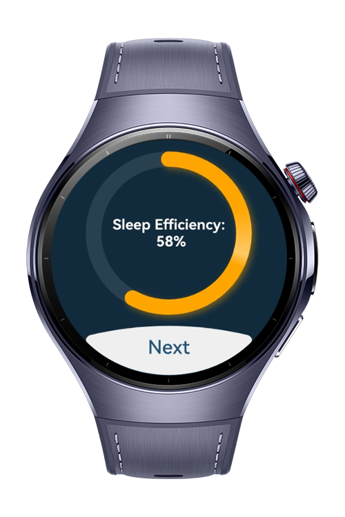

> **Note:** To access all shared projects, get information about environment setup, and view other guides, please visit [Explore-In-HMOS-Wearable Index](https://github.com/Explore-In-HMOS-Wearable/hmos-index).

# Sleep Tracker
Sleep Tracker is a smartwatch application built with ArkTS, designed to help users wake up more naturally and peacefully. Instead of using loud sounds, the app relies on gentle vibrations to wake the user at their set alarm time.
After waking up, the app provides insightful reports based on the user’s sleep session, including:

- Total sleep duration
- Sleep efficiency
- Estimated dream (REM) time
- Number of times the user woke up during sleep
- Analysis of whether the number of wake-ups is within a normal range

The goal of the app is to improve users' sleep quality, promote better wake-up experiences aligned with natural sleep cycles, and increase awareness of personal sleep habits.

# Preview

<div>
  
  
  
  
</div>

# Use Cases:

- Vibration-Only Alarm:
Wake up naturally with silent vibration, avoiding the stress of loud alarms.

- Sleep Reports:
After each sleep session, receive a detailed summary including total sleep time, sleep efficiency, and more.

- REM Estimation:
Get an estimated duration of your dream (REM) phase to better understand sleep quality.

- Wake-Up Frequency Analysis:
Track how many times you woke up during the night and whether this count is considered normal.

- Minimal, Smartwatch-Optimized UI:
Designed specifically for smartwatch interfaces using ArkTS, with smooth performance and intuitive interaction.

# Tech Stack
Languages: ArkTS, Typescript
Frameworks: HarmonyOS SDK 5.1.0(18)
Tools: DevEco Studio Vers 5.1.0.842
Libraries: @kit.ArkUI, @kit.HealthServiceKit

* **Languages:** ArkTS, Typescript
* **Frameworks:** HarmonyOS SDK 5.1.0(18)
* **Tools:** DevEco Studio 5.1.0.842
* **Libraries:** @kit.ArkUI, @kit.HealthServiceKit

# Directory Structure

```
entry/
└── src/
    └── main/
        └── ets/
            ├── entryability/              # Entry definition for the app
            ├── entrybackupability/        # Backup entry point
            └── pages/                     # UI pages and screens
                ├── AlarmWatcher.ets           # Handles alarm state and triggering
                ├── FeaturesList.ets           # Displays a list of sleep tracking features
                ├── Index.ets                  # Main entry screen
                ├── Result.ets                 # Main results overview screen
                ├── ResultDuration.ets         # Calculates and shows total sleep duration
                ├── ResultRem.ets              # Estimates REM (dream) phase duration
                ├── ResultWakeCount.ets        # Tracks and displays wake-up count
                ├── SetAlarm.ets               # UI for setting the vibration alarm
                ├── SleepEfficiency.ets        # Calculates sleep efficiency score
            └── service/
                └── AlarmService.ets           # Logic for handling alarm-related functionality
        └── resources/
            └── module.json5               # Module metadata and configuration
.gitignore                                 # Git version control exclusions
build-profile.json5                        # Build profile for packaging
hvigorfile.ts                              # Huawei’s Hvigor build configuration
oh-package.json5                           # HarmonyOS package definition
```

# Constraints and Restrictions

## Supported Device

* Huawei Watch 5

# LICENSE
Sleep Tracker is distributed under the terms of the MIT License.
See the [LICENSE](./LICENSE) for more information.